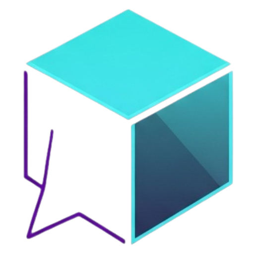

#  Whisper Box - Mysterious Messaging


Whisper Box is a cutting-edge messaging application built with Next.js that provides seamless communication with modern UI/UX design and robust functionality.

## 🚀 Features

### ✨ Core Functionality
- **🔐 Secure Authentication** - Full user registration, login, and email verification system
- **💬 Real-time Messaging** - Send and receive messages instantly
- **📊 Analytics Dashboard** - Visual statistics with charts and metrics
- **👤 Custom User Profiles** - Personalized URLs for each user (`/u/username`)
- **📱 Responsive Design** - Works seamlessly across all devices

### 🎯 Advanced Features
- **Message Management** - Accept, delete, and organize messages
- **User Statistics** - Track message counts and engagement metrics
- **Email Notifications** - Verification emails via Resend
- **Modern UI Components** - Built with shadcn/ui for consistent design

## 📸 Application Preview

*(Screenshots would be added here showing the dashboard, messaging interface, and user profiles)*

## 🛠️ Technology Stack

### 🏗️ Core Framework
 


### 🗄️ Database & Storage


### 🔐 Authentication & Services


### 🎨 UI Components


## 🎮 Usage

### Getting Started
1. **Sign Up** - Create a new account with email verification or with GOOGLE
2. **Customize Profile** - Set up your unique username and profile
3. **Share Your Link** - Share your profile URL (`/u/yourusername`) with others
4. **Send Messages** - Start receiving and managing messages

### Key Routes
- `/` - Home page
- `/signup` - User registration
- `/login` - User login
- `/dashboard` - User dashboard with analytics
- `/messages` - Message management
- `/u/[username]` - Public user profile
- `/setting` - User profile settings

## 🏗️ Project Structure

```
src/
├── app/                    # Next.js app router pages
│   ├── api/               # API routes
│   │   ├── auth/          # Authentication endpoints
│   │   ├── chat/          # Chat functionality
│   │   └── messages/      # Message management
│   ├── dashboard/         # User dashboard
│   ├── login/             # Login page
│   ├── signup/            # Signup page
│   └── u/[username]/      # User to send message
├── components/            # React components
│   ├── ui/               # shadcn/ui components
│   └── providers/        # Context providers
├── context/              # React context
├── lib/                  # Utility libraries
├── models/               # Database models
├── schemas/              # Validation schemas
└── types/                # TypeScript type definitions
```

## 🤝 Contributing

We welcome contributions! Please follow these steps:

1. Fork the repository
2. Create a feature branch (`git checkout -b feature/amazing-feature`)
3. Commit your changes (`git commit -m 'Add amazing feature'`)
4. Push to the branch (`git push origin feature/amazing-feature`)
5. Open a Pull Request


## 📄 License

This project is licensed under the MIT License - see the [LICENSE](LICENSE) file for details.

## 🆘 Support

If you encounter any issues or have questions:

1. Check the [issues page](https://github.com/axadishaq/whisper-box/issues)
2. Create a new issue with detailed description
3. Join our community discussions

## 🙏 Acknowledgments

- [Next.js](https://nextjs.org/) team for the amazing framework
- [shadcn/ui](https://ui.shadcn.com/) for beautiful components
- [MongoDB](https://www.mongodb.com/) for reliable database
- [Resend](https://resend.com/) for email services

---

⭐ **Star this repo if you find it useful!**
