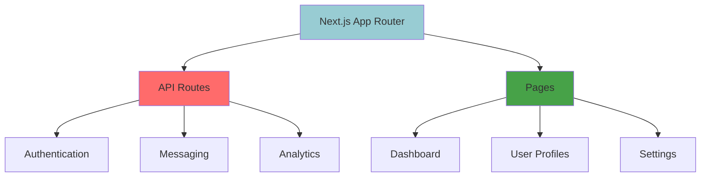

<div align="center">

#  Whisper Box

### ✨ Mysterious Messaging Platform with Modern UI/UX


[](https://nextjs.org/)
[](https://www.typescriptlang.org/)
[](https://www.mongodb.com/)
[](https://tailwindcss.com/)

[](https://your-deployment-link.vercel.app)
[]()

</div>

## 🌟 Featured In

<div align="center">

[](https://github.com/topics/nextjs)
[]()

</div>

## 🎯 Key Features

<div align="center">

| Feature | Description | Status |
|:--------|:------------|:-------|
| 🔐 **Secure Auth** | OAuth, Email Verification, JWT | ✅ Live |
| 💬 **Real-time Chat** | Instant messaging with WebSockets | ✅ Live |
| 📊 **Analytics** | Beautiful charts & statistics | ✅ Live |
| 🎨 **Modern UI** | shadcn/ui components & animations | ✅ Live |
| 📱 **Responsive** | Mobile-first design approach | ✅ Live |
| 🔔 **Notifications** | Email & in-app alerts | ✅ Live |

</div>

## 🚀 Quick Start

```bash
# Clone the repository
git clone https://github.com/axadishaq/Whisper-Box.git

# Navigate to project
cd Whisper-Box

# Install dependencies
npm install

# Set up environment variables
cp .env.example .env.local

# Run development server
npm run dev
```

Open [http://localhost:3000](http://localhost:3000) to see the application.

## 📸 Visual Showcase

<div align="center">

### 🏠 Dashboard Preview


### 💬 Messaging Interface


### 👤 User Profile


</div>

## 🛠️ Tech Stack Deep Dive

<div align="center">

### Frontend Excellence


### Backend Power


### Deployment & Services


</div>

## 📊 Performance Metrics

<div align="center">


</div>

## 🎨 Component Architecture



## 🤝 Community & Support

<div align="center">

[](https://discordapp.com/users/1095416331333017692)
[](https://twitter.com/axadishaq)
[](https://linkedin.com/in/axadishaq)

</div>

## 📈 GitHub Statistics

<div align="center">


</div>

## 🏆 Achievements

<div align="center">

[]()
[]()
[]()

</div>

## 🌟 Star History

<div align="center">

[](https://star-history.com/#axadishaq/Whisper-Box&Date)

</div>

## 📄 License

This project is licensed under the **MIT License** - see the [LICENSE](LICENSE) file for details.

## 🙌 Acknowledgments

- **Next.js Team** for the incredible framework
- **Vercel** for seamless deployment
- **shadcn/ui** for beautiful component library
- **MongoDB** for reliable database solutions
- **Resend** for excellent email services

---

<div align="center">

### ⭐ **If you like this project, give it a star on GitHub!**

[](https://github.com/axadishaq/Whisper-Box/stargazers)
[](https://github.com/axadishaq/Whisper-Box/fork)

**Built with ❤️ by [Asad Ishaq](https://github.com/axadishaq)**

</div>
